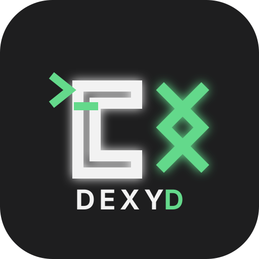

<div align="center">
  

# Dexyd

**A mobile control surface for Codex and OMX sessions.**

Pair your phone with your computer, manage sessions by project, chat with agents, answer approvals, inspect diffs, and keep bridge/mobile updates close at hand.

[](https://github.com/DrB0rk/dexyd/releases/latest)
[](docs/mobile-app.md)
[](docs/installation.md)
[](docs/bridge-tui.md)
[](docs/security.md)
[](#license)

</div>

---

## Why Dexyd?

Dexyd runs a small bridge on your computer and connects it to a trusted mobile app. It is built for people who use Codex/OMX locally and want a clean phone interface for monitoring and steering sessions without exposing their whole machine carelessly.

## Highlights

- **Pair once, switch easily** — save one or more bridge profiles on your phone.
- **Sessions by project** — see Codex/OMX sessions grouped by workspace.
- **Focused chat** — open chat only from a session, with no distracting bottom nav.
- **Queued follow-ups** — send another message while a session is busy and steer queued prompts before they run.
- **Approvals and questions** — answer agent prompts from integrated mobile UI.
- **Per-prompt diffs** — view changed files after a completed response.
- **Useful notifications** — responses, prompt completion, alerts, approvals, questions, and important account-usage changes.
- **Connection setup** — LAN, HTTPS domain/Caddy, or Cloudflare named tunnel from the TUI.
- **Built-in updates** — update the bridge/TUI from the TUI and the Android APK from the mobile app.

## Requirements

- Linux or Windows computer for the bridge/TUI.
- Node.js 20+ and Python 3; installers check required dependencies where possible.
- Codex CLI authenticated on the bridge computer.
- Optional: OMX for OMX-backed sessions and harness behavior.
- Android phone with the Dexyd APK installed.
- Optional remote access: HTTPS domain/Caddy or Cloudflare named tunnel.

## Install the bridge

Linux:

```bash
curl -fsSL https://raw.githubusercontent.com/DrB0rk/dexyd/main/scripts/install.sh | bash
```

Windows PowerShell:

```powershell
iwr https://raw.githubusercontent.com/DrB0rk/dexyd/main/scripts/install.ps1 -UseBasicParsing | iex
```

The installer:

- installs into the app data location, normally `~/.local/share/dexyd` on Linux or `%LOCALAPPDATA%\Dexyd` on Windows;
- creates `dexyd.config.yaml` with your home directory as the workspace root;
- installs bridge and TUI dependencies;
- builds the bridge;
- links the `dexyd` command;
- installs/restarts the Linux user service when available; on Windows run `dexyd` in a terminal for the bridge;
- does **not** build or install the Android app.

Open the setup console:

```bash
dexyd --tui
```

On Windows, open a second terminal and run `dexyd` to keep the bridge in the foreground when not using a service manager.

Clean an installed bridge before reinstalling:

```bash
curl -fsSL https://raw.githubusercontent.com/DrB0rk/dexyd/main/scripts/install.sh | bash -s -- --clean
```

```powershell
$installer = "$env:TEMP\dexyd-install.ps1"
iwr https://raw.githubusercontent.com/DrB0rk/dexyd/main/scripts/install.ps1 -UseBasicParsing -OutFile $installer
powershell -NoProfile -ExecutionPolicy Bypass -File $installer -Clean
```

## Run the self-hosted web control app

Dexyd can also run a browser control UI in Docker while the bridge and TUI stay installed on your system:

```bash
dexyd --tui              # or keep dexyd.service running
docker compose up -d --build
```

Open `http://localhost:8080` or `http://<computer-lan-ip>:8080`. The container only serves the web page and proxies to the host bridge at `http://127.0.0.1:4242` using Docker host networking; it does not run Codex, the bridge, or the TUI.

See [Self-hosted web control app](docs/web-app.md).

## Install the Android app

Download the latest APK from GitHub Releases:

[Latest Dexyd release](https://github.com/DrB0rk/dexyd/releases/latest)

Install the APK on your phone, then pair it with the bridge from the TUI.

## Pair your phone

1. Run `dexyd --tui` on your computer.
2. Open **Connection** and choose LAN, domain/Caddy, or Cloudflare named tunnel.
3. Save the connection and install/start the Dexyd service.
4. Generate a fresh QR code in **Connection**.
5. Scan the QR from the mobile app onboarding or **Settings → Pairing**.
6. Open **Sessions** on the phone and select a session to chat.

Pairing QR codes are short-lived. Generate a new QR after changing LAN/domain/tunnel settings.

## Updating

### Bridge and TUI

Open:

```bash
dexyd --tui
```

Go to **Updates → Check updates → Install / repair bridge**. The TUI reruns the official installer for the latest release tag in the installed app directory, streams progress, verifies the command target/version, and preserves `dexyd.config.yaml` and `.dexyd` data. Restart the TUI after updating.

### Android app

Open **Settings → Updates** in the app. Dexyd checks the latest GitHub Release, stages the attached APK through Android's PackageInstaller update flow, and opens the Android update confirmation prompt.

Android does not allow normal APK apps to silently self-update; you still confirm the installation, but you no longer need to open a downloaded APK file manually.

## Security model in short

- Pairing is local/private-network restricted and short-lived.
- Mobile access uses trusted-device credentials and refresh tokens.
- Old phones can be revoked.
- Mobile-started Codex turns default to desktop-style unsandboxed execution through `codex.permissionMode: bypass`; change it to `inherit`, `workspace-write`, or `read-only` if you want a stricter mode.
- Project/file access is confined to `codex.workspaceRoot`.
- Prefer HTTPS or Cloudflare named tunnels outside your LAN.
- Keep the bridge on networks you trust.

Read more in [Security model](docs/security.md).

## Documentation

- [Installation](docs/installation.md)
- [Bridge and TUI](docs/bridge-tui.md)
- [Mobile app](docs/mobile-app.md)
- [Configuration](docs/configuration.md)
- [Troubleshooting](docs/troubleshooting.md)
- [API reference](docs/api-reference.md)
- [Release strategy](docs/release-strategy.md)

## Created by

Dexyd is created and maintained by **DrB0rk**.

- GitHub: [github.com/DrB0rk/dexyd](https://github.com/DrB0rk/dexyd)

## License

No license has been declared yet. Until a license is added, all rights are reserved by default.
